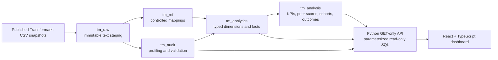

# Football Player Value Analytics

A reproducible football analytics project for exploring player market value in
the context of performance, age, position, club, competition, and transfer
activity. The project combines a time-aware PostgreSQL model, versioned
analytical methods, a read-only Python API, and a responsive React dashboard.

> Market value is a dated estimate, not a transfer fee or a complete measure of
> player quality. The dashboard is designed for exploration and scouting
> prioritization, not as an automatic recruitment recommendation.

**Project status:** Phases 1-4 are complete and verified end to end. Phase 5
(sensitivity testing, cross-page reconciliation, and portfolio communication)
is planned.

## Table of contents

- [What this project demonstrates](#what-this-project-demonstrates)
- [Dashboard](#dashboard)
- [Architecture](#architecture)
- [Data scope and freshness](#data-scope-and-freshness)
- [Analytical methodology](#analytical-methodology)
- [Technology stack](#technology-stack)
- [Run locally](#run-locally)
- [Rebuild the complete data pipeline](#rebuild-the-complete-data-pipeline)
- [Validation](#validation)
- [Repository structure](#repository-structure)
- [Known limitations](#known-limitations)
- [Documentation](#documentation)
- [Data attribution](#data-attribution)

## What this project demonstrates

- Relational data modeling at appearance, player-club-season,
  player-competition-season, valuation, and transfer grains.
- Reproducible ingestion and profiling of 12 published source tables containing
  7,497,433 rows in the current snapshot.
- Historical as-of joins that never use a valuation recorded after the relevant
  match, season end, or transfer date.
- Position-aware peer comparisons instead of one universal player score.
- Explicit handling of missing data, ambiguous zero fees, stale valuations,
  incomplete coverage, and small samples.
- A React dashboard backed by parameterized, read-only PostgreSQL queries.
- Automated validation and reconciliation evidence committed as CSV and JSON
  reports.

## Dashboard

The responsive dashboard contains seven analytical pages:

| Page | Main questions |
| --- | --- |
| **Market Overview** | How are aligned player values distributed by competition, position, and age? |
| **Value & Performance** | Which players show strong observed contribution relative to their peer-group market value? |
| **Player Journey** | How did a player's dated valuations, season records, and recorded transfers evolve? |
| **Team Analysis** | Who appeared for a selected team and season, what was the squad composition, and what was its aligned contributor value? |
| **Transfer Analysis** | How did estimated market value change 6, 12, and 24 months after recorded transfers? |
| **Club Development** | How did comparable players' values change across consecutive seasons associated with a club? |
| **Quality & Method** | How fresh and complete is the data, and which parameters and weights drive the analysis? |

The charts include point value labels and hover/focus tooltips. Team Analysis
also provides case- and diacritic-insensitive search by club or competition.
The interface does not use player photos or club logos whose usage rights have
not been verified.

## Architecture



PostgreSQL is the analytical system of record. Credentials remain on the
server and are never embedded in the React application. The API serves both
JSON routes and the production frontend build, so the completed dashboard can
run as one local process.

## Data scope and freshness

The confirmed v1 analytical scope is:

- Competitions: Premier League (`GB1`), La Liga (`ES1`), Serie A (`IT1`),
  Bundesliga (`L1`), and Ligue 1 (`FR1`).
- Season start years: 2023, 2024, and 2025.
- Main value-efficiency ranking: outfield players with at least 900 minutes and
  a positive, sufficiently fresh aligned season-end valuation.
- Team rosters: every player with at least one valid appearance for the selected
  club, competition, and season, including goalkeepers and limited-minute
  players.

Current source boundaries:

| Source area | Latest observed date |
| --- | ---: |
| Games | 2026-07-06 |
| Appearances | 2026-06-28 |
| Player valuations | 2026-06-12 |
| Game events | 2026-07-06 |
| Game lineups | 2026-07-06 |

These dates describe the loaded snapshot; values should not be interpreted as
real-time or current beyond their stated observation date.

## Analytical methodology

The default **Value Efficiency Score** compares players only within
`season x competition x position group` peers:

```text
Value Efficiency Score = Performance Z-Score - Market Value Z-Score
```

Inputs are winsorized at the 5th and 95th percentiles, standardized within the
peer group, and combined with versioned position-specific weights. Market value
is transformed with `ln(1 + value)` before standardization. Every ranking keeps
the season, competition, position, minutes, peer sample size, valuation date,
and valuation lag visible.

Important interpretation rules:

- `market value` is an estimated valuation at a dated snapshot;
- `transfer fee` is a recorded transaction amount and remains analytically
  separate from market value;
- `performance` describes observed match contribution, not potential;
- `high_relative_efficiency` is an exploratory label, not an objective
  undervaluation claim;
- value change is not sporting or financial ROI; and
- correlations and before/after comparisons are associations, not evidence of
  causality.

See [the Phase 3 methodology](docs/phase3-methodology.md) for eligibility,
weights, cohort construction, and post-transfer outcome definitions.

## Technology stack

| Layer | Technology |
| --- | --- |
| Database | PostgreSQL, SQL |
| Data pipeline and API | Python 3.10+, `psycopg` 3 |
| Dashboard | React 19, TypeScript, Vite 7 |
| Visualizations | Accessible, dependency-light SVG components |
| Testing and verification | Python `unittest`, SQL validation tables, Playwright browser checks |

The project is verified with PostgreSQL 18.4, Python 3.10.9, and Node.js
24.17.0. Vite 7 requires Node.js `^20.19.0` or `>=22.12.0`.

## Run locally

Use this path when the PostgreSQL schemas have already been built.

### Prerequisites

- PostgreSQL with the project database available locally;
- Python 3.10 or newer;
- Node.js `^20.19.0` or `>=22.12.0`; and
- npm.

### 1. Create the local Python environment

```powershell
python -m venv .venv
.\.venv\Scripts\Activate.ps1
python -m pip install -r requirements.txt
```

On Linux or macOS, activate it with `source .venv/bin/activate` instead.

### 2. Configure PostgreSQL

Copy the safe template and replace its placeholders with your local values:

```powershell
Copy-Item .env.example .env
```

```dotenv
PGHOST=localhost
PGPORT=5432
PGDATABASE=football_analytics
PGUSER=postgres
PGPASSWORD=your_local_password
```

`DATABASE_URL` may be used instead of the individual `PG*` variables. The
local `.env` file is ignored by Git; never commit real credentials.

### 3. Build and start the dashboard

```powershell
cd frontend
npm ci
npm run build
cd ..
python src\dashboard_api.py
```

Open [http://127.0.0.1:8000](http://127.0.0.1:8000). The server binds to the
loopback interface by default.

For frontend development, keep the API running and start Vite in another
terminal:

```powershell
cd frontend
npm run dev
```

Then open [http://127.0.0.1:5173](http://127.0.0.1:5173). Vite proxies `/api`
requests to the Python service on port 8000.

## Rebuild the complete data pipeline

Use this path for a clean database or to reproduce all committed analytical
outputs. The acquisition step downloads the published snapshots into
`data/raw/`; these files are intentionally excluded from Git.

### Phase 1: acquire, load, and audit

```powershell
python src\acquire_data.py
python src\create_database.py
python src\load_postgres.py
python src\audit_phase1.py
python src\investigate_phase1_findings.py
python src\verify_phase1.py
```

The PostgreSQL role must be allowed to create the configured database. If the
database already exists, `create_database.py` leaves it unchanged. Use
`load_postgres.py --replace` only when you intentionally want to rebuild the
project staging and reference tables.

### Phase 2: build the typed analytical model

```powershell
python src\inspect_phase2_inputs.py
python src\build_phase2.py --replace
python src\validate_phase2.py
python src\verify_phase2.py
```

### Phase 3: build KPIs and exploratory analysis

```powershell
python src\inspect_phase3_inputs.py
python src\build_phase3.py --replace
python src\validate_phase3.py
python src\summarize_phase3.py
python src\verify_phase3.py
```

### Phase 4: build and verify the dashboard

```powershell
cd frontend
npm ci
npm run build
cd ..
python src\validate_phase4.py
python -m unittest discover -s tests -v
```

The `--replace` options above target only the named project schemas; they do not
drop the PostgreSQL database or unrelated schemas.

## Validation

The current implementation passes the following automated checks:

| Layer | Result |
| --- | ---: |
| Phase 1 source key checks | 13/13 passed |
| Phase 2 analytical-model checks | 43/43 passed |
| Phase 3 KPI and methodology checks | 51/51 passed |
| Phase 4 dashboard/API checks | 32/32 passed |
| Repository unit and integration tests | 22/22 passed |

Phase 2 reconciles appearance rows, minutes, goals, and assists exactly to the
eligible source inputs. Browser verification covers all seven pages at desktop
and mobile viewports, filter interactions, player drill-through, team search,
and console errors or warnings.

Evidence is available in:

- [`reports/data_audit/`](reports/data_audit/) for source profiling and Phase 1;
- [`reports/data_model/`](reports/data_model/) for Phase 2 model validation;
- [`reports/analysis/`](reports/analysis/) for Phase 3 analytical outputs; and
- [`reports/dashboard/`](reports/dashboard/) for Phase 4 API and browser checks.

## Repository structure

```text
.
|-- config/                   # Controlled mappings and interpretation rules
|-- data/                     # Ignored raw/interim/processed local data
|-- docs/                     # Phase runbooks and methodology
|-- frontend/                 # React + TypeScript dashboard
|-- reports/                  # Committed audit and validation evidence
|-- sql/                      # Versioned Phase 2 and Phase 3 SQL models
|-- src/                      # Acquisition, modeling, validation, and API code
|-- tests/                    # Repository checks and API integration tests
|-- .env.example              # Safe local connection template
`-- requirements.txt          # Python dependency lock
```

## Known limitations

- Positive numeric fees are available for only 17,554 transfer rows (10.02%);
  recorded zero and missing fees remain separate rather than being inferred as
  free transfers or loans.
- Fourteen of fifteen competition-seasons have complete game-to-appearance
  coverage. Ligue 1 2025 contains 305 of 306 games with appearance data.
- Available performance inputs do not include richer role-specific metrics such
  as expected goals, tackles, interceptions, aerial duels, or goalkeeper
  actions. Goalkeepers are therefore excluded from the main efficiency score.
- Historical entity coverage is broader than the current player and club master
  tables, so unresolved source relationships remain visible instead of being
  filled with manufactured dimension records.
- Team aligned value is the sum of each contributor's latest positive valuation
  on or before their last club appearance, with a maximum 365-day lag. It is
  not an official published squad valuation.
- The included Python server is intended for local portfolio use. Public
  deployment would require authentication, HTTPS, request throttling,
  structured logging, a production reverse proxy, and a least-privilege
  database role.

## Documentation

- [Phase 1: PostgreSQL data foundation](docs/phase1-postgresql.md)
- [Phase 2: analytical data model](docs/phase2-data-model.md)
- [Phase 3: KPI and exploratory methodology](docs/phase3-methodology.md)
- [Phase 4: React dashboard](docs/phase4-react-dashboard.md)
- [Analytical decisions and caveats](reports/phase4-decisions.md)

## Data attribution

The primary source is
[`dcaribou/transfermarkt-datasets`](https://github.com/dcaribou/transfermarkt-datasets),
which republishes data originating from Transfermarkt. This repository does not
commit the downloaded source files. Review and comply with the source project's
terms and the original data provider's conditions before redistributing or
using the data beyond local analytical or portfolio purposes.
